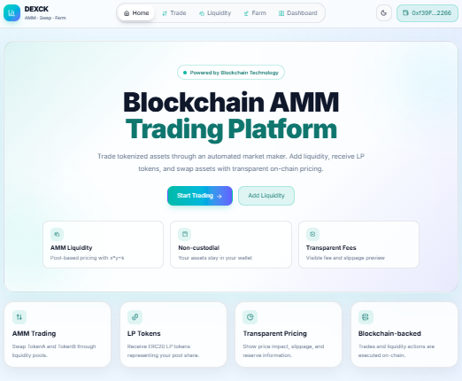
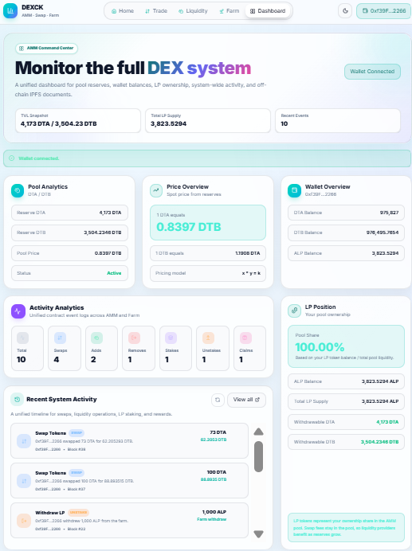
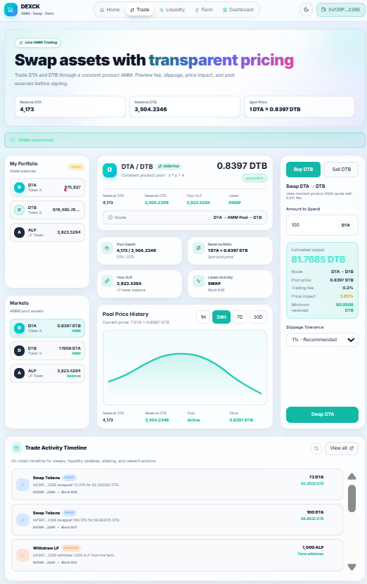
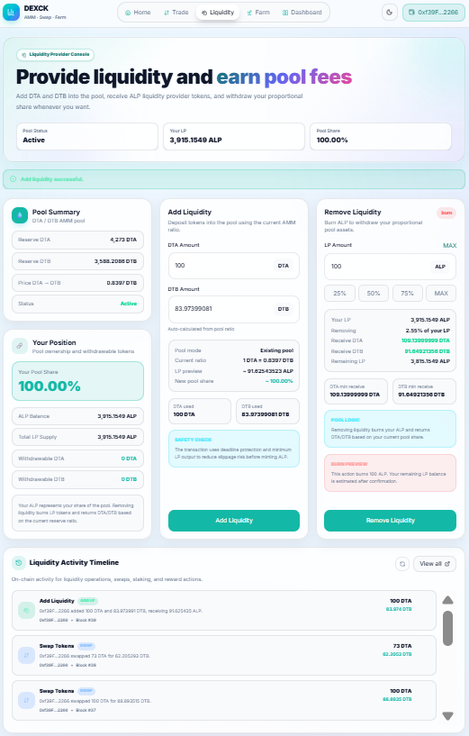
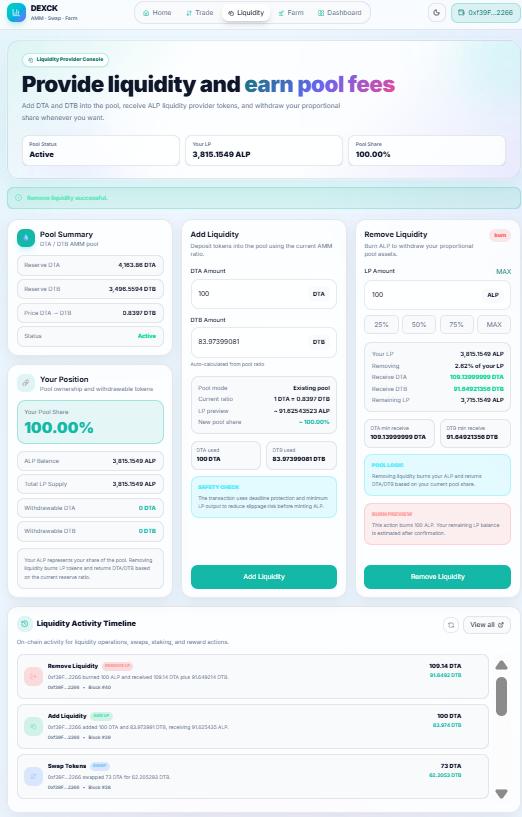
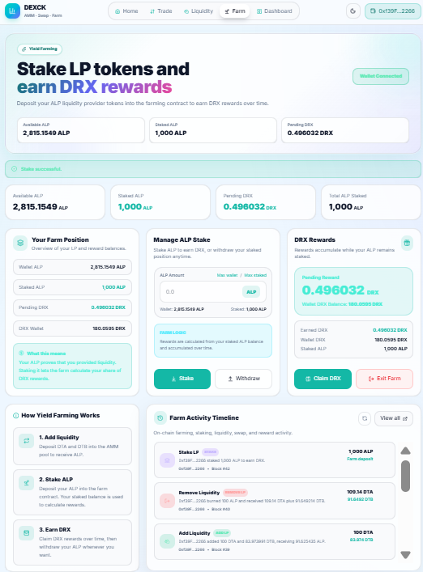
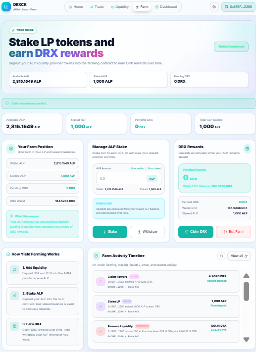
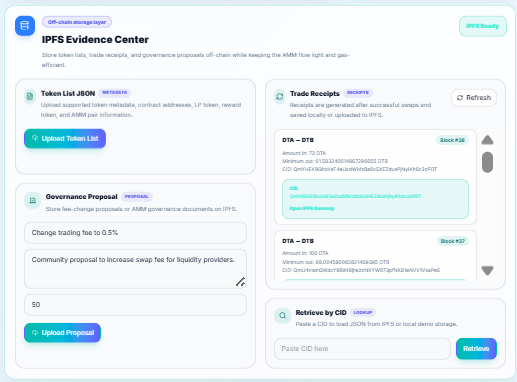

# DEX AMM Solidity

Portfolio-ready decentralized exchange demo built with Solidity, Hardhat, and React.  
The project implements a constant-product AMM (x * y = k), LP token lifecycle, staking rewards, on-chain activity tracking, and an IPFS Evidence Center with Pinata integration and local fallback mode.

## Tech Stack

| Layer | Technologies |
|---|---|
| Smart contracts | Solidity 0.8.24, OpenZeppelin ERC20, ReentrancyGuard |
| Dev tooling | Hardhat 3, Mocha, Chai, Ethers 6 |
| Frontend | React 19, Vite 8, ethers.js 6, TailwindCSS 4 |
| Storage | IPFS via Pinata API (optional), localStorage fallback mode |

## Core Features

- ERC20 demo tokens (DTA, DTB) for local testing
- AMM swap with constant product formula x * y = k
- Add liquidity
- Remove liquidity
- LP token mint and burn (ALP)
- 0.3% trading fee (997/1000 input factor)
- Slippage protection (min output checks)
- Deadline protection (expiry checks)
- Yield farming by staking LP tokens
- DRX reward token distribution
- Dashboard analytics
- On-chain activity history (swap, liquidity, staking, rewards)
- IPFS Evidence Center in frontend dashboard

## Smart Contract Overview

| Contract | Purpose |
|---|---|
| contracts/MockERC20.sol | Demo ERC20 tokens for Token A and Token B |
| contracts/SimpleAMM.sol | Core AMM logic: add/remove liquidity, swap, reserves, pricing, fee math |
| contracts/LPToken.sol | LP token contract minted and burned only by the AMM |
| contracts/DEXRewardToken.sol | Reward ERC20 token (DRX), mintable by owner |
| contracts/StakingRewards.sol | LP staking, reward accrual, claim, withdraw, and exit flow |

## Frontend Overview

Main pages:

- Dashboard
- Trade
- Liquidity
- Farm
- IPFS Evidence Center (inside dashboard)

Frontend architecture highlights:

- Page entry points in frontend/src/pages
- Feature layouts in frontend/src/features
- Contract interaction hooks in frontend/src/hooks
- Contract instances in frontend/src/lib/contracts.js
- ABI files in frontend/src/abi
- Synced deployment addresses in frontend/src/contracts/addresses.json

## IPFS Features

- Upload token list JSON
- Download trade receipt JSON after swaps
- Upload governance proposal JSON
- Retrieve JSON document by CID
- Local fallback mode when VITE_PINATA_JWT is not configured:
  - Uploads are stored in browser localStorage with local-* pseudo-CID
  - Retrieval supports both real IPFS CIDs and local-* IDs

## Installation

### Root dependencies

```bash
npm install
```

### Frontend dependencies

```bash
cd frontend
npm install
```

## Compile, Test, and Deploy

### Compile contracts

```bash
npm run clean
npm run compile
```

`npm run compile` compiles Solidity contracts and generates Hardhat artifacts.

### Run tests

```bash
npm test
```

`npm test` runs Hardhat contract tests.

### Start local blockchain

```bash
npm run node
```

`npm run node` starts a local Hardhat blockchain.

### Deploy contracts to localhost

```bash
npm run deploy:localhost
```

`npm run deploy:localhost` deploys demo tokens, AMM, LP token, reward token, staking contract, initializes liquidity, funds demo accounts, and writes deployment addresses.

### Sync ABIs and addresses to frontend

```bash
npm run sync:frontend
```

`npm run sync:frontend` copies contract ABI and deployment addresses into frontend/src/abi and frontend/src/contracts.

## Run Frontend

### From root

```bash
npm run frontend:dev
```

`npm run frontend:dev` starts the Vite frontend.

### Or from frontend folder

```bash
cd frontend
npm run dev
```

Build:

```bash
cd frontend
npm run build
```

## Local Demo Flow

Terminal 1:

```bash
npm run node
```

Terminal 2:

```bash
npm run deploy:localhost
npm run sync:frontend
npm run frontend:dev
```

## MetaMask Local Network Setup

The frontend attempts automatic network switch/add to Hardhat Local via wallet_switchEthereumChain and wallet_addEthereumChain.

Manual setup (if needed):

- Network name: Hardhat Local
- RPC URL: http://127.0.0.1:8545
- Chain ID: 31337 (or value in deployments/localhost.json)
- Currency symbol: ETH

Use one of the private keys printed by npm run node to import a funded local account into MetaMask.

## Demo Walkthrough

1. Start node and deploy contracts.
2. Sync frontend contract artifacts.
3. Connect MetaMask to Hardhat Local.
4. Open Dashboard to review reserves, balances, LP share, and activity.
5. Execute a swap on Trade and verify receipt generation.
6. Add and remove liquidity on Liquidity page.
7. Stake ALP, claim DRX, and exit on Farm page.
8. Use IPFS Evidence Center to upload token list/proposal and retrieve JSON by CID.

Detailed presenter script: docs/DEMO_SCRIPT.md.

## Troubleshooting

| Issue | Cause | Fix |
|---|---|---|
| Wrong network in MetaMask | MetaMask not on localhost chain | Switch to Hardhat Local (chain ID 31337) and reconnect wallet |
| Invalid contract address in UI | Frontend using stale deployment file | Run npm run deploy:localhost then npm run sync:frontend |
| Contract changes not reflected | Old artifacts/deployment in use | Run npm run clean, npm run compile, redeploy, then sync frontend |
| ABI mismatch errors | frontend/src/abi outdated | Run npm run sync:frontend after compile/deploy |
| Native binding or install issues | Corrupted node_modules / lockfile | Delete node_modules, reinstall with npm install |
| Pinata upload unavailable | VITE_PINATA_JWT missing/invalid | Set VITE_PINATA_JWT for real IPFS uploads, or continue in local fallback mode |

## Screenshot Placeholders

Add screenshots under docs/screenshots and keep the names below:

- docs/screenshots/01-home.png
- docs/screenshots/02-dashboard.png
- docs/screenshots/03-trade-swap.png
- docs/screenshots/04-liquidity-add.png
- docs/screenshots/05-liquidity-remove.png
- docs/screenshots/06-farm-stake.png
- docs/screenshots/07-farm-claim.png
- docs/screenshots/08-ipfs-center.png

Markdown placeholders:










## License

MIT
